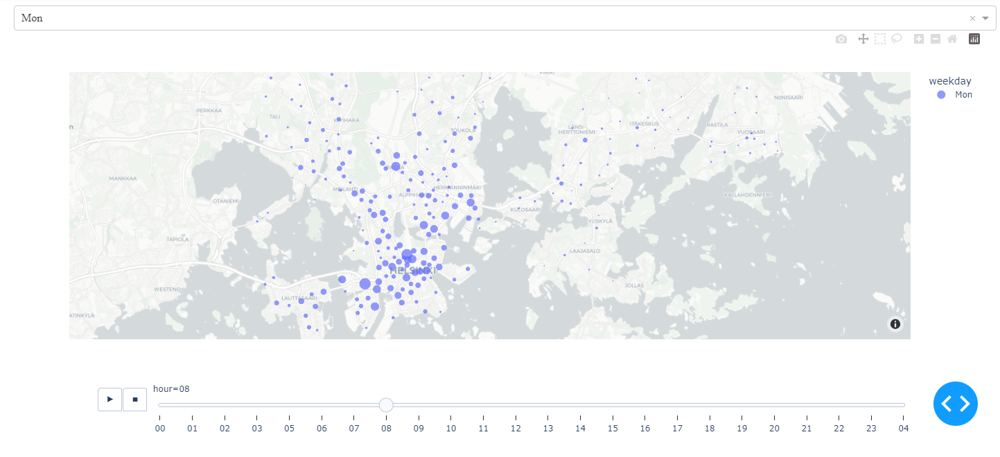

# City Bike Stations Analysis

This project is a data analysis one aiming to study the activity levels and identify the busy hours at city bike stations. 

### Data:
```
data/station_locations.csv : Helsinki bike stations
data/2021-08.csv           : City bike activity in August
```

### Setup:
```
1. python3 -m venv venv # create the virtual env. for the project
2. .\venv\Scripts\activate # activate venv in Windows 
3. pip install -r requirements.txt # install the dependencies
4. jupyter-lab # launch JupyterLab(Notebook) locally
```

### Visualization:

At the top of the figure, there is a dropdown menu to select the weekday, and at the bottom, there is a slider to display different hours of the selected day. By hovering the mouse over each station/point, additional details can be viewed.

### Links:
[City bike stations’ data](https://hri.fi/data/en_GB/dataset/helsingin-ja-espoon-kaupunkipyorilla-ajatut-matkat)<br />
[Helsinki region bike stations](https://hri.fi/data/en_GB/dataset/hsl-n-kaupunkipyoraasemat)